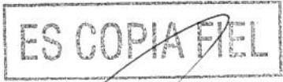
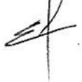
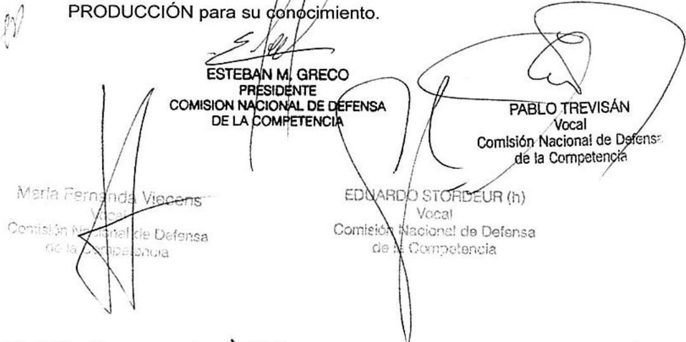

# Expte. N° S01: 0228293/2017 (Conc.1470) CQ-RG

BUENOS AIRES, 27 JUL 2017

## SEÑOR SECRETARIO

Elevamos para su consideración el presente dictamen referido a la operación de concentracion económica que tramita bajo el Expediente N° S01: 0228293/2017 del registro del MINISTERIO DE PRODUCCIÓN, caratulado“DEUTSCHE BANK AKTIENGESELLSCHAFT, SÜDDEUTSCHE VERMÖGENSVERWALTUNG GESELLSCHAFT MIT BESCHRÄNKTER HAFTUNG Y BANCO COMAEI S A S/ NOTIFICACION ART. 8 DE LA LEY 25.156 (CONC. 1470)”, en trámite ante esta COMISIÓN NACIONAL DE DEFENSA DE LA COMPETENCIA

## I. DESCRIPCIÓN DE LA OPERACIÓN Y ACTIVIDAD DE LAS PARTES

## I.1.La Operación

1. El dia 16 de junio de 2017, esta Comisión Nacional recibió la notificación de una operacion de concentración económica, consistente en la adquisición por parte de BANCO COMAFI S.A. (en adelante “BANCO COMAFI”) a DEUTSCHE BANK AKTIENGESELLSCHAFT (en adelante “DEUTSCHE") y a SÜDDEUTSCHE VERMOGENSVERWALTUNG GESELLSCHAFT MIT BESCHRÄNKTER HAFTUNG (en adelante "SUDDEUTSCHE”) del 100% del capital social y votos de DEUTSCHE BANK S.A. (en adelante “DEUTSCHE BANK”)

2. La operación se instrumentó a través de un contrato de compraventa de fecha 26 de agosto de 2016, quedando perfeccionada en fecha 2 de junio de 20171 momento en el cual los vendedores notificaron a DEUTSCHE BANK, en los términos del artículo 215 do la Ley N° 19550, la venta de las acciones a favor de la compradora ². La oneración fue notificada en tiempo y forma, dentro del primer día hábil posterior al cierre³

# Ministerio de Producción

I.2. Las partes y la actividad de las empresas involucradas en la operación.

## I.2.1. La compradora

3. BANCO COMAFI, una sociedadconstituida, conforme las leyes de la República Argentina, dedicada a la actividad financiera, debidamente inscripta en laInspección General de Justicia. Controla en forma directa a COMAFI FIDUCIARIO FINANCIERO S.A. y posee participaciones directas en GRAMIT S.A., sociedades involucradas en esta operación cuya actividad se detalla más adelante.

4. Sus accionistas sonCOMAFI S.A. titular del 76,35% de las acciones, FAMICER PARTICIPACIONES S.A. titular del 7,32% y la firma PASMAN S.A. que posee el 6,94% de las acciones. COMAFI S.A., es controlada en forma directa por el Sr. Guillermo Alejandro CERVIÑO quien posee el55,54% de sus acciones. En relación con la actividad financiera, el Sr. CERVIÑO, controla directamente oindirectamenteen la República Argentina las siguientes empresas cuyas actividades se detallan más adelante: a COMAFI BURSÁTIL S.A. SOCIEDAD DE BOLSA (83,05%), TCC LEASING S.A. (83,71%), FAMICER PARTICIPACIONES S.A., FLIACER PARTICIPACIONES S.A. (95%), CFC PARTICIPACIONESS.A.,PVCRED S.A., PRESTAMOSDIRIGIDOSS.A., GRAMIT S.A.; FINASIST S.A.y a NUBI S.A. (48,54%).

## 1.2.2. La vendedora

5. DEUTSCHE es una sociedad por acciones constituida conforme las leyes de la República Federal de Alemania, inscripta en el Registro Público de Comercio en los términos delArt.123de la Ley19.550, suCUIT es 30709410179. El único accionista informado es BLACKROCK, INC., quien posee el 5.95 % de las acciones,

6. SÜDDEUTSCHE es una sociedad de responsabilidad limitada constituida conforme las leyes de la República Federal de Alemania, inscripta en el Registro Público de Comercio en los términos del Art. 123 de la Ley 19.550, su CUIT 30715607928. Su único accionista es la firma DB FINANZ-HOLDING GMBH que posee el 100% de sus acciones.

## 1.2.3 El objeto

7. DEUTSCHEBANKes una sociedad constituida conforme las leyesde laRepública procesales en todos los expedientes y/o actuaciones administrativas en trámite ante esta COMISIÓ NACIONAL desde el día 2 de junio de 2017 y por el lapso de DIEZ (10) días hábiles admihistrativos.

Argentina, dedicada a brindar servicios de la banca mayorista.

8. En la Tabla 1 se consignan las compañías involucradas en la operación, junto a una descripción de la actividad comercial que permite identificar una relación horizontal en la actividad de servicios bancarios.

Tabla 1 - Actividad de la Firmas Involucradas
<table><tr><td rowspan=1 colspan=1>Empresas</td><td rowspan=1 colspan=1>Actividad</td></tr><tr><td rowspan=1 colspan=1>BANCO COMAFI S.A.(Grupo comprador)</td><td rowspan=1 colspan=1>Servicios de banca mayorista yminorista.</td></tr><tr><td rowspan=1 colspan=1>COMAFI FIDUCIARIO FINANCIEROS.A.(Grupo comprador)</td><td rowspan=1 colspan=1>Prestador de servicios fiduciarios</td></tr><tr><td rowspan=1 colspan=1>COMAFI S.A.(Grupo comprador)</td><td rowspan=1 colspan=1>Actividades de inversión</td></tr><tr><td rowspan=1 colspan=1>COMAFI BURSÀTIL S.A. SOCIEDADDE BOLSA(Grupo comprador)</td><td rowspan=1 colspan=1>Agente de bolsa</td></tr><tr><td rowspan=1 colspan=1>TCC LEASING S.A.(Grupo comprador)</td><td rowspan=1 colspan=1>Asesoramiento de leasing</td></tr><tr><td rowspan=1 colspan=1>FAMICER PARTICIPACIONES S.A.(Grupo comprador)</td><td rowspan=1 colspan=1>Actividades de inversión</td></tr><tr><td rowspan=1 colspan=1>FLIACER PARTICIPACIONES S.A.(Grupo comprador)</td><td rowspan=1 colspan=1>Actividades de inversión</td></tr><tr><td rowspan=1 colspan=1>CFC PARTICIPACIONES S.A.(Grupo comprador)</td><td rowspan=1 colspan=1>Actividades de inversión</td></tr><tr><td rowspan=1 colspan=1>PVCRED S.A.(Grupo comprador)</td><td rowspan=1 colspan=1>Actividades complementarias a laactividad financiera</td></tr><tr><td rowspan=1 colspan=1>PRÈSTAMOS DIRIGIDOS S.A.(Grupo comprador)</td><td rowspan=1 colspan=1>Comercializa créditos de consumo</td></tr><tr><td rowspan=1 colspan=1>GRAMIT S.A.(Grupo comprador)</td><td rowspan=1 colspan=1>Comercializa la tarjeta de créditopara consumo CREDIAL</td></tr><tr><td rowspan=1 colspan=1>FINASIST S.A.(Grupo comprador)</td><td rowspan=1 colspan=1>Comercializa, a través de la web,préstamos de BANCO COMAFIS.A.</td></tr><tr><td rowspan=1 colspan=1>NUBI S.A.(Grupo comprador)</td><td rowspan=1 colspan=1>Servicios empresariales deintermediación para cobro y cargade saldos virtuales registrados enlas redes de medios electrónicosde pago</td></tr><tr><td rowspan=1 colspan=1>DEUTSCHE BANK S.A.(Objeto)</td><td rowspan=1 colspan=1>Servicios de banca mayorista4.</td></tr></table>

## II. EFECTOS DE LA OPERACIÓN DE CONCENTRACIÓN NOTIFICADA

## Il.1. Efectos Económicos de la Operación

9. En ocasiones anteriores5, esta COMISIÓN NACIONAL a la hora de analizar los servicios bancarios ha tenido en cuenta cuatro variables fundamentales que hacen al posicionamiento de cada entidad: depósitos, préstamos, patrimonio neto y otros activos. El Banco Central de la República Argentina publica un ranking sobre la base de estas cuatro variables. Asimismo, esta COMISIÓN NACIONAL en lo que respecta al alcance geográfico de la actividad de servicios bancarios ha realizado su análisis tanto a nivel nacional como a nivel local, en función de las posibilidades de sustitución desde el punto de vista de la oferta y de la demanda.

10. Considerando la información provista por la Superintendencia de Entidades Financieras y Cambiarias publicada por el BANCO CENTRAL DE LA REPÚBLICA ARGENTINA(en adelante “BCRA”) con fecha 31de enero de 2017, la participación conjunta a nivel nacional de las empresas involucradas en lo que respecta a depósitos, préstamos, patrimonio neto y otros activos es inferior al 1,5% en todos los casos.

11. Puede observarse que dentro del mercado de servicios bancarios en la República Argentina, los principales bancos ordenados en función de su patrimonio neto, operan en los dos segmentos, el minorista y mayorista. Entre ellos podemos mencionar a los banCOS NACIÓN,PROVINCIA DE BUENOS AIRES, SANTANDER RIO, CITIBANK, ICBC, BANCO DE GALICIA Y BUENOSAIRES, BBVA, HSBC6, etc. Por consiguiente, la competencia que deberá enfrentar la entidad resultante será significativa.

12. Por su parte, indagando el mercado geográfico local de la Ciudad Autónoma de Buenos Aires, que es la única localidad en la que DEUTSCHE BANK tiene presencia, según el Informe de Información de Entidades Financieras del BCRA a febrero de 20177, existen 813sucursales bancarias y17sucursales de compañías financierasè

Comisión Nacional de Defensa de la Competencia

reguladas por el BCRA. DEUTSCHEBANK junto a BANCO COMAFI poseen 18 sucursales en CABA (1 y 17 sucursales respectivamente) lo que representa el 2% de la totalidad de sucursales financieras presentes en el mercado local.

13. En función de lo expuesto, analizada la presente operación no se encontraron elementos que indiquen que la misma permita disminuir, restringir o distorsionar la competencia, de modo que pueda resultar en un perjuicio para el interés económico general.

## Il.2. Cláusulas de Restricciones Accesorias

14. Habiendo analizado la documentación aportada en la presente operación, esta Comisión Nacional advierte la presencia de dos cláusulas en el documento denominado Oferta Irrevocable N°001-2016 de fecha 26 de agosto de 2016, identificadas como “6.16 Prohibición de competir" y “6.17 Prohibición de contratar personal" en las que se prevén, por el plazo de dos (2) años a partir de la fecha de cierre de la operación, una serie de prohibiciones dirigidas a los vendedores tendientes a impedir que estos realicen la actividad que desarrolla el objeto como así también la captación de empleados de la misma.

15. En principio, las partes tienen la facultad de arribar a acuerdos que regulen recíprocamente sus derechos y obligaciones, incluso en esta materia, y lo acordado constituiría la expresión del ejercicio de su libertad de comerciar libremente. No obstante, las restricciones accesorias que pueden encontrarse alcanzadas por el Artículo 7 de la Ley, son aquellas que se constituyen en barreras a la entrada al mercado y siempre que dicha barrera tenga la potencialidad de resultar perjuicio para el interés económico general.

16. Tal como se desprende de la Sección IV de la Resolución SCyDC N° 164/2001 “Lineamientos para el Control de las Concentraciones Económicas”, las barreras a la entrada cobran importancia en el análisis de una operación notificada cuando la misma produce o fortalece una posición de dominancia en el mercado, por cuanto se entiende que la amenaza del ingreso de nuevos competidores constituye un freno a la capacidad de las empresas existentes en el mercado de subir sus precios.

17. Por ello, las cláusulas con restricciones accesorias deben considerarse en el marco de la evaluación integral de los efectos que la operación notificada tendría sobre la competencia, tal como ha sido explícitamente recogido comolfundamento de/la decisión

Comisión Nacional de Defensa de la. Competencia

revocatoria de la Resolución SC N° 63/2012 realizada por la Cámara Civil y Comercial Federal – Sala 1 en la Causa 25.240/15/CA.

18. En este contexto es en el cual la autoridad debe analizar y considerar los criterios de necesidad, vinculación, duración, partes involucradas y las respectivas definiciones de los mercados geográficos y del producto afectados por la operación notificada.

19. No obstante, los lineamientos establecidos en los puntos precedentes, y tal como lo ha señalado reiteradamente esta Comisión Nacional, el análisis de este tipo de restricciones debe efectuarse a la luz de las condiciones en que se desenvuelve la competencia en cada mercado y sobre la base de un análisis caso por caso.

20. Asimismo, las objeciones contra las restricciones accesorias deben fundarse con la misma rigurosidad con que se fundamente cualquier objeción al acuerdo que instrumenta la operación notificada, quedando a cargo de esta Comisión proveer evidencia suficiente para encuadrar el acuerdo y/o las cláusulas de restricciones accesorias en el Artículo 7 de la Ley, al atribuirles por objeto o efecto restringir o distorsionar la competencia, de modo que pueda resultar perjuicio para el interés económico general. En ese mismo sentido también se ha expresado el fallo precitado.

21. En este caso, y según se ha expuesto en la sección precedente, esta Comisión Nacional no ha encontrado elementos de preocupación sobre los efectos en la competencia de la operación notificada.

22. En referencia a la cláusula 6.5 confidencialidad8, esta Comisión considera que la misma no constituye una cláusula que pueda importar una restricción accesoria a la operación notificada dentro de los términos del Artículo 7° de la Ley 25.156 9.

23. Por tanto, siguiendo con la línea de razonamiento descripta en los párrafos precedentes, en el caso bajo análisis, la operación notificada no presenta ningún elemento de preocupación desde el punto de vista de defensa de la competencia, por lo cual, las restricciones accesorias a dicha operación acordada por las partes contratantes, por sí mismas no tienen potencial entidad como para restringir o distorsionar la competencia de modo que pueda resultar en perjuicio para el interés económico general.

Comisión Nacional de Defensa de la Competencia

## III. ENCUADRAMIENTO JURÍDICO Y PROCEDIMIENTO

24. Finalmente, debe destacarse que la transacción analizada en apartados anteriores constituye una concentración económica en los términos del Artículo 6° inciso c) de la Ley N° 25.156 de Defensa de la Competencia y que las firmas intervinientes en la misma la han notificado en tiempo y forma, de acuerdo a lo previsto en el Artículo 8º de la misma norma.1º

25. Con fecha 16 de junio de 2017, las partes notificaron la operación mediante la presentación conjunta del Formulario F1 correspondiente yel 7 de julio de 2017, aportaron información complementaria a dicho formulario, el cual se tuvo por completo el día hábil posterior a la última fecha reseñada.

26. Con fecha 16 de junio de 2017 esta COMISIÓN NACIONAL recibióuna nota del BANCO CENTRAL DE LA REPÚBLICA ARGENTINA emitida con fecha 1°de junio de 207 donde el organismo informa, en virtud de la intervención que le compete conforme establece el artículo 16 de la Ley N° 25.156, que no formuló objeciones a la adquisición de la totalidad del paquete accionario de DEUTSCHE BANK, acompañado copia de Resolución N° 184 de fecha 24 de mayo de 2017.

## Ill.1. Dispensa solicitada por las consultantes

27. Con fecha 7 de julio de 2017 las partes acompañaron copia del acuerdo de confidencialidad de fecha 8 de marzo de 2016 suscripto en idioma inglés, afirmando que el mismo no limita la competencia y solicitando se las eximiera de acompañar la traducción al idioma nacional en los términos del punto b) del apartado C de la Resolución SDCyC 40/01.

28. En este sentido y considerando gue en el acuerdo se regulan deberes y obligaciones de confidencialidad sobre información de la sociedad obtenida por la compradora con motivo de evaluar la transacción. que finalmente se concretó mediante el contrato de compra de fecha 26 de agosto de 2016, esta COMISIÓN NACIONAL considera que se ha cumplido con lo previsto en el artículo 2 inciso f. de la ResoluciónSC 40/01 por resultar suficiente la información acompañada a efectos de analizar la operación

Ministerio de Producción Secretaria de Comercio Comisión Nacional de Defensa de la Competencia

ES COPIAFIEL

notificada. Por lo tanto se considera que el acuerdo de confidencialidad en su versión en su idioma original resulta satisfactoria, de acuerdo a lo dispuesto en la normativa citada, y se aconseja que la autoridad de aplicación conceda la dispensa solicitada por las partes respecto de la traducción del documento mencionado.

29. Por lo expuesto, se recomienda al SR. SECRETARIO DE COMERCIO dispensar a los consultantes de acompañar la traducción oportunamente solicitada.

## IV. CONCLUSIONES

30. De acuerdo a lo expuesto precedentemente, esta COMISIÓN NACIONAL DE DEFENSA DE LA COMPETENCIA concluye que la operación de concentración económica notificada no infringe el Artículo 7º de la Ley Nº 25.156, al no disminuir, restringir o distorsionar la competencia de modo que pueda resultar perjuicio al interés económico general.

31. Por ello, esta COMISIN NACIONAL DE DEFENSA DE LA COMPETENCIA aconseja al SEÑOR SECRETARIO DE COMERCIO: a) autorizar la operación notificada consistente en la adquisición por parte de BANCO COMAFI S.A. a DEUTSCHE BANK AKTIENGESELLSCHAFT y a SÜDDEUTSCHE VERMÖGENSVERWALTUNG GESELLSCHAFTMIT BESCHRÄNKTERHAFTUNG del 100%delcapitalsocial y votos de DEUTSCHE BANK S.A., todo ello en virtud de lo establecido en el Artículo 13 inc. (a) de la Ley N°25.156 y b) Dispensar a las consultantes de acompañar la traducciónal idioma nacional del documento acompañado con fecha 7 de julio de 2017.

32. Elévese el presente Dictamnery al Señor Secretario de Comercio, previo paso por la DIRECCIÓN GENERALE ASUNTOS JURÍDICOS deI MINISTERIO DE PRODUCCIÓN para su conócimiento.

# Hoja Adicional de Firmas Anexo

Número:

Referencia: S01:0228293/2017 CONC.1470

El documento fue importado por el sistema GEDO con un total de 8 pagina/s.

Digitally signed by GESTION DOCUMENTAL ELECTRONICA - GDE

DN: cn=GESTION DOCUMENTAL ELECTRONICA - GDE, c=AR, o=MINISTERIO DE MODERNIZACION,

ou=SECRETARIA DE MODERNIZACION ADMINISTRATIVA, serialNumber=CUIT 30715117564

Date: 2017.07.28 09:24:26 -03'00

# República Argentina - Poder Ejecutivo Nacional 2017 - Año de las Energías Renovables

# Resolución

## Número:

Referencia: EXP-S01:0228293/2017 - OPERACIÓN DE CONCENTRACIÓN ECONÓMICA (CONC. 1470)

VISTO el Expediente Nº S01:0228293/2017 del Registro del MINISTERIO DE PRODUCCIÓN, y

## CONSIDERANDO:

Que, en las operaciones de concentración económica en las que intervengan empresas cuya envergadura determine que deban realizar la notificación prevista en el Artículo 8° de la Ley Nº 25.156, procede su presentación y tramitación por los obligados ante la COMISIÓN NACIONAL DE DEFENSA DE LA COMPETENCIA, organismo desconcentrado en el ámbito de la SECRETARÍA DE COMERCIO del MINISTERIO DE PRODUCCIÓN, en virtud de lo dispuesto y por la integración armónica de los Artículos 6° a 16 y 58 de dicha ley.

Que la operación, que se notifica el día 16 de junio 2017 consiste en la adquisición por parte de la firma BANCO COMAFI SOCIEDAD ANÓNIMA a la firma DEUTSCHE BANK AKTIENGESELLSCHAFT y a la firma SÜDDEUTSCHE VERMÖGENSVERWALTUNG GESELLSCHAFT MIT BESCHRӒNKTER HAFTUNG del CIEN POR CIENTO (100 %) del capital social y voto de la firma DEUTSCHE BANK S.A.

Que la operación se instrumentó a través de un Contrato de Compraventa de fecha 26 de agosto de 2016, quedando perfeccionada el día 2 de junio de 2017.

Que, con fecha 7 de julio de 2017, las partes presentaron en el expediente de la referencia, copia del acuerdo de confidencialidad de fecha 8 de marzo de 2016 suscripto en idioma inglés, afirmando que el mismo no limita la competencia y solicitando que se les eximiera de acompañar la traducción al idioma nacional.

Que, asimismo, la citada Comisión Nacional considera que se ha cumplido con lo previsto en el inciso f) del punto 2 del Formulario F1 del Anexo I de la Resolución N° 40 de fecha 22 de febrero de 2001 de la ex SECRETARÍA DE DEFENSA DE LA COMPETENCIA Y DEL CONSUMIDOR del ex MINISTERIO DE ECONOMÍA, por lo que resulta suficiente la información acompañada por las partes.

Que la operación notificada constituye una concentración económica en los términos del inciso c) del Artículo $\bar { 6 ^ { \circ } }$ de la Ley N° 25.156.

Que la obligación de efectuar la notificación obedece a que el volumen de negocios de las firmas involucradas y el objeto de la operación en la REPÚBLICA ARGENTINA supera el umbral la suma de PESOS DOSCIENTOS MILLONES (\$ 200.000.000) establecido en el Artículo 8° de la Ley N° 25.156, y no se encuentra alcanzada por ninguna de las excepciones previstas en dicha norma.

Que, en virtud del análisis realizado, la COMISIÓN NACIONAL DE DEFENSA DE LA COMPETENCIA concluye que la operación de concentración económica notificada no infringe el Artículo $7 ^ { \circ }$ de la Ley N° 25.156, toda vez que de los elementos reunidos en el expediente citado en el Visto no se desprende que tenga entidad suficiente para restringir o distorsionar la competencia de modo que pueda resultar perjuicio al interés económico general.

Que, la mencionada Comisión Nacional emitió el Dictamen N° 163 de fecha 27 de julio de 2017, donde aconseja al señor Secretario de Comercio autorizar la operación notificada, consistente en la adquisición por parte de la firma BANCO COMAFI SOCIEDAD ANÓNIMA a la firma DEUTSCHE BANK AKTIENGESELLSCHAFT y a la firma SÜDDEUTSCHE VERMÖGENSVERWALTUNG GESELLSCHAFT MIT BESCHRӒNKTER HAFTUNG del CIEN POR CIENTO (100 %) del capital social y voto de la firma DEUTSCHE BANK S.A., todo ello en virtud de lo establecido en el inciso a) del Artículo 13 de la Ley N° 25.156; y dispensar a las consultantes de acompañar la traducción al idioma nacional del documento presentado con fecha 7 de julio de 2017 en el expediente citado en el Visto.

Que el suscripto comparte los términos del mencionado dictamen, al cual cabe remitirse en honor a la brevedad, incluyéndose como Anexo de la presente resolución.

Que la Dirección General de Asuntos Jurídicos del MINISTERIO DE PRODUCCIÓN ha tomado la intervención que le compete.

Que el infrascripto resulta competente para el dictado del presente acto en virtud de lo establecido en los Artículos 13, 18, 21 y 58 de la Ley N° 25.156 y los Decretos Nros. 89 de fecha 25 de enero de 2001, 357 de fecha 21 de febrero de 2002 y sus modificaciones y 718 de fecha 27 de mayo de 2016.

Por ello,

## EL SECRETARIO DE COMERCIO

## RESUELVE:

ARTÍCULO 1°.- Autorízase la operación de concentración económica consistente en la adquisición por parte de la firma BANCO COMAFI SOCIEDAD ANÓNIMA a la firma DEUTSCHE BANK AKTIENGESELLSCHAFT y a la firma SÜDDEUTSCHE VERMÖGENSVERWALTUNG GESELLSCHAFT MIT BESCHRӒNKTER HAFTUNG del CIEN POR CIENTO (100 %) del capital social y voto de la firma DEUTSCHE BANK S.A., todo ello en virtud de lo establecido en el inciso a) del Artículo 13 de la Ley N° 25.156.

ARTÍCULO 2°.- Dispénsese a las consultantes de acompañar la traducción pública al idioma nacional del documento presentado con fecha 7 de julio de 2017 en el expediente de la referencia.

ARTÍCULO 3°.- Considérase al Dictamen N° 163 de fecha 27 de julio de 2017 emitido por la COMISIÓN NACIONAL DE DEFENSA DE LA COMPETENCIA, organismo desconcentrado en el ámbito de la SECRETARÍA DE COMERCIO del MINISTERIO DE PRODUCCIÓN, que como Anexo, IF-2017- 15650889-APN-DR#CNDC, forma parte integrante de la presente medida.

ARTÍCULO 4°.- Notifíquese a las partes interesadas.

ARTÍCULO 5°.- Comuníquese y archívese.

Digitally signed by BRAUN Migue Date: 2017.08.30 19:05:43 ART Location: Ciudad Autónoma de Buenos Aires